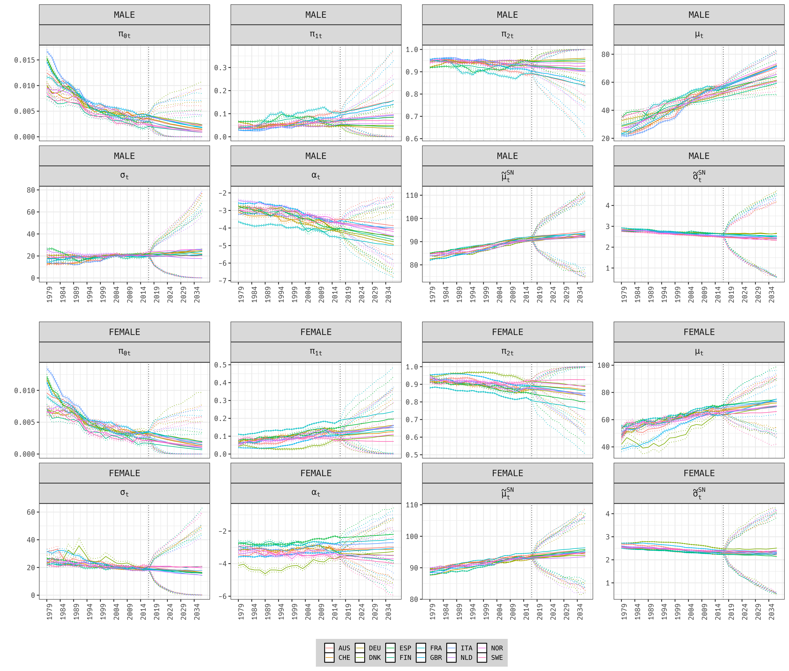

# Dynamic modeling of mortality via mixtures of skewed distribution functions [dysm]

This repository is associated with the [paper](https://arxiv.org/abs/2102.01599): Aliverti, Mazzuco, Scarpa (2021). Dynamic modeling of mortality via mixtures of skewed distribution functions.

It contains code implementing the method and to reproduce the main results of the papers.

1. [`download_data/`](https://github.com/emanuelealiverti/dysm/tree/main/download_data)  contains instruction on how to download the data from  [Human Mortality Database](https://www.mortality.org/). Users need to be [registered](https://www.mortality.org/mp/auth.pl) and provide their credentials in the script `download_data/get_data.R`. The registration is free and generally validated in few hours.

1. [`APPLICATION/`](https://github.com/emanuelealiverti/dysm/tree/main/download_data) contains the main code implementing the method, the c++ utilities related to the Owen-T function and Skew-Normal distribution, and instructions on how to reproduce results from the paper (such as the figure reported below).
    - In order to reproduce the results, it is necessary to download the data at point 1, and run `APPLICATION/00_Run_PostInference.r` for the male and female populations and save the MCMC sample (100k iterations require approximately 3hours).
    - The script compile automatically the internal c++ utilities, creating a compiled `APPLICATION/skew_cdf.o`, which is internally linked to [nimble](https://r-nimble.org/) MCMC. (check [`APPLICATION/nimble_model_integral.r`](https://github.com/emanuelealiverti/dysm/blob/main/APPLICATION/nimble_utilities.r#L6-L12))
    - The script `APPLICATION/01_PlotResults.r` loads the MCMC sample, computes forecasts, and reproduce the figure below.

